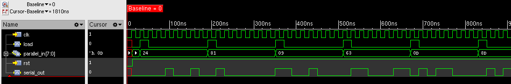

# Parallel to Serial Testbench

## Overview

This testbench simulates a parallel to serial converter in SystemVerilog. It focuses on taking parallel data as input and shifting it serially, bit by bit. The testbench includes all the necessary modules for signal generation, data loading, monitoring, and verification.

### How Parallel to Serial Works:
- The system loads parallel data into a shift register on the rising edge of the clock.
- The data is then shifted out serially, one bit at a time, on each clock cycle.
- The output is verified by monitoring both parallel and serial data, ensuring that the correct bits are shifted out.

### Modules Included:
- **Clock Generator**: Generates a clock signal for the simulation.
- **Driver**: Loads parallel data into the system.
- **Generator**: Generates random parallel input data for testing.
- **Monitor**: Monitors the signals and captures the parallel and serial data.
- **Parallel to Serial**: The DUT (Device Under Test) that converts parallel data to serial.
- **Scoreboard**: Verifies that the serial data matches the expected parallel data.

## Waveform

## DUT: Parallel to Serial Converter

This module is the core of the testbench. It takes parallel input and shifts the data serially, using a shift register. The output is available on the serial output signal.

### Key Signals:
- **clk**: Clock input
- **rst**: Reset input
- **load**: Load signal to load parallel data
- **parallel_in**: Parallel input data
- **serial_out**: Serial output data